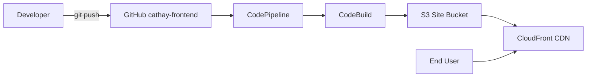

---

# `cathay-frontend/README.md`

```markdown
# cathay-frontend — React + Vite on S3/CloudFront (CI/CD)

以 **React + TypeScript + Vite** 開發的前端，透過 **AWS CodePipeline + CodeBuild** 自動建置並發佈到 **S3**，由 **CloudFront** 對外服務。  
基礎設施（S3/CloudFront/SSM 參數）由 IaC repo 負責佈署：

- IaC（CloudFormation）：https://github.com/fanfan0412/CFTemplatesRepo

> 預設部署區域：**ap-northeast-1 (Tokyo)**
```
---

## Live（上線網址）
- https://diqh11tmow6os.cloudfront.net/
---

## 技術棧

* React 18 + TypeScript + Vite

* AWS S3（靜態網站）

* AWS CloudFront（CDN）

* AWS CodePipeline + CodeBuild（CI/CD）

* AWS Systems Manager Parameter Store（提供部署參數）
---

## 本地開發
```bash
# 建議 Node.js 20+
npm ci
npm run dev
# http://localhost:5173
```
## 建置與本地預覽
```
npm run build
npm run preview
```
---
# CI/CD（CodePipeline + CodeBuild）
## Pipeline 行為
* Source：GitHub（本 repo）`main`
* Build：CodeBuild（Source from CodePipeline）
* 流程：
  1. `npm ci && npm run build`
  2. 從 SSM 讀取網站桶 / Distribution ID
  3. `aws s3 sync dist/ s3://<bucket>/ --delete`
  4. `cloudfront create-invalidation`（預設 `/*`，可按需改為 `/index.html`）
---
# 環境參數
## SSM（由 IaC 建立）
* `/cafe/frontend/bucket`：S3 目標桶名，例如 `cafe-frontend-<account>-ap-northeast-1`
* `/cafe/frontend/distribution`：CloudFront Distribution ID

## （可選）第三方 API 範例
`.env`
```
VITE_API_BASE_URL=https://api.open-meteo.com/v1
```
`src/api/client.ts`
```
const base = import.meta.env.VITE_API_BASE_URL ?? "https://api.open-meteo.com/v1";

export async function fetchWeather(lat: number, lon: number) {
  const url = `${base}/forecast?latitude=${lat}&longitude=${lon}&hourly=temperature_2m`;
  const res = await fetch(url);
  if (!res.ok) throw new Error(`API ${res.status}`);
  return res.json();
}
```
---
## 專案結構
```arduino
cathay-frontend/
├─ public/
├─ src/
├─ buildspec.yml
├─ package.json
└─ vite.config.ts
```
---
## 架構圖

---
## 疑難排解
* CloudFront 失效 AccessDenied
  給 CodeBuild 服務角色 cloudfront:CreateInvalidation，限制到你的 Distribution ARN。

* S3 AccessDenied（List/Put/Delete）
  CodeBuild 角色需對網站桶具備：s3:ListBucket, s3:GetBucketLocation, s3:PutObject, s3:DeleteObject。

* SSM AccessDenied
  CodeBuild 角色需 ssm:GetParameter(s) 讀 /cafe/frontend/bucket、/cafe/frontend/distribution。

* Node 版本警告
  buildspec.yml 已指定 runtime-versions.nodejs: 20；若仍警告，請確認 CodeBuild image 支援。

* 找不到 CloudFront 網域
  於 the-cafe-frontend 堆疊 Outputs 查 CloudFrontDomain。
---

## 相關連結
* IaC（CloudFormation）：https://github.com/fanfan0412/CFTemplatesRepo
